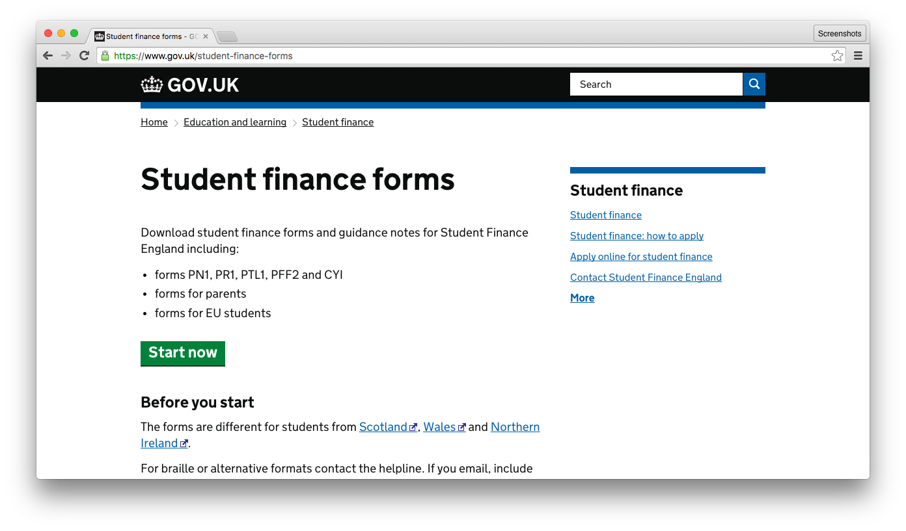

# Smart Answers

> Smart answers are a great tool for content designers to present complex information in a quick and simple way. Defining what they are – decision trees? calculators? tools? is immaterial – what they do is provide a reusable technical framework to build a quick and simple answer to a complex question.

Read more in [Lisa Scott's GDS blog post](https://gds.blog.gov.uk/2012/02/16/smart-answers-are-smart/).

## Screenshots

## Live examples

* [Look up Meursing code](https://www.gov.uk/additional-commodity-code)
* [Maternity and paternity calculator for employers](https://www.gov.uk/maternity-paternity-calculator)
* [Towing: licence and age requirements](https://www.gov.uk/towing-rules)

## Nomenclature

* **Smart Answer**: The flow, questions and outcomes.

* **Flow**: Defines the questions, outcomes and the rules for navigating between them.

* **Landing page**: Contains a description of the Smart Answer and the "Start now" button that leads to the first question.

* **Question page**: Contains an individual question that's asked in order to help arrive at at an outcome.

* **Outcome page**: Contains the result of the Smart Answer based on responses to individual questions.

## Technical documentation

This is a Ruby on Rails application that both contains and serves the Smart Answers stored in this repository. Smart Answers are presented to public users.

**NOTE.** This application doesn't use a database.

Read more about the [structure and syntax of Smart Answers](doc/smart-answer-flows.md).

### Dependencies

* [alphagov/static](https://github.com/alphagov/static): provides static assets (JS/CSS) and the GOV.UK templates.

### Running the application

See [development using the GDS development virtual machine](doc/developing-using-vm.md).

### Running the test suite

    $ bundle exec rake

### Smart Answers

* [File structure](doc/file-structure.md)
* [Flow definition](doc/flow-definition.md)

### Process

* [Creating a new Smart Answer](doc/creating-a-new-smart-answer.md)
* [Archiving a Smart Answer](doc/archiving.md)
* [Continuous integration](doc/continuous-integration.md)
* [Deploying changes for Factcheck](doc/factcheck.md)
* [Deploying](doc/deploying.md)
* [Merging pull requests from the content team](doc/merging-content-prs.md)
* [Handling exceptions with Errbit](doc/errbit.md)

### Development

* [Environments](doc/environments.md)
* [Refactoring existing Smart Answers](doc/refactoring.md)
* [Common errors you might run into during development](doc/common-errors.md)
* Adding [content-ids](doc/content-ids.md) to Smart Answers
* [Developing using the VM](doc/developing-using-vm.md)
* [Developing without using the VM](doc/developing-without-vm.md)
* [Issues and Todo](https://trello.com/b/7HgyU4hy/smart-answers-tasks)
* [Rubocop](doc/rubocop.md)
* [Testing](doc/testing.md)
* [Updating worldwide fixture data](doc/updating-worldwide-fixture-data.md)

### Debugging

* [Viewing landing pages and outcomes as Govspeak](doc/viewing-templates-as-govspeak.md)
* [Viewing state of a Smart Answer](doc/viewing-state.md)
* [Visualising flows](doc/visualising-flows.md)

## Licence

[MIT License](./LICENSE.md)
